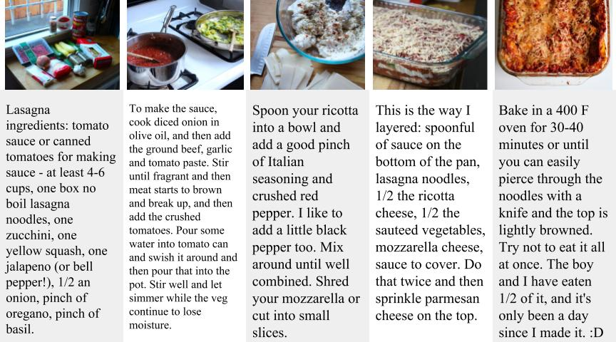

## Welcome to Storyboarding

Information processing in real world is mostly multi-modal in nature. One of such associations between language and corresponding visual interpretation is observed in the task of **storyboarding**. A storyboard is a concise series of visual illustrations of how a video would unfold, along with their corresponding textual descriptions. 

We present the task of storyboarding of _howto_ tasks in the domain of cooking recipes. 

Imagine, you want to cook vegetable lasagna. Most likely, you would open a _howto_ videos of the correspoding dish and follow the instructions. More often than not, we find ourselves in situations where we might not need to watch the entire video but rather get a concise summary of important moments in the video along with natural language instructions.

## Big Picture:

This storyboard is like a short visual as well as textual description to give an overview for cooking the dish. This can also be applied to other _howto_ tasks, let's say "how to fix a guitar string". This also leads to interesting dimensions of looking at the breadth and depth of the recipes.

## Dataset:

We are presenting this new dataset that is targeted at generating procedural text (cooking recipes) from a sequence of images. This resource could also be used for language tasks aiming to maintain structure and coherence. The dataset is mainly scraped from a couple of blogging websites (_instructables_ and _snapguide_), where people put _howto_ posts on various tasks in varied domains. For this task, we first concentrate on the cooking domain and we collected about **16,441 recipes** that have sequential visual illustration and textual interpretation.

The topics present in this dataset are visualized here:

**Visualization of 20 topics in our dataset**
<a href="20topics.html" target="_blank">20 Topics Visualization</a>

**Visualization of 40 topics in our dataset**
<a href="40topics.html" target="_blank">40 Topics Visualization</a>

